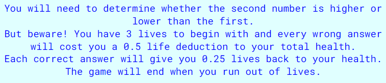

<h1>Survival Maths</h1>
Survival Maths is a maths game that requires the user to choose whether the second number generated to the screen in higher or lower than the first. The user initially has 3 lives, that can be detracted from by 0.5 increments if an incorrect answer is chosen. The user has a chance to earn back lives in 0.25 increments for every correct answer chosen. The user can also keep track of their high score, which will update and save every time the top score is beaten and the game is reset. 
 
The purpose of this game is to test the user's number comprehension, in this case it is the ability to understand the relation between two random numbers. The concept of the lives is included to add an element of urgency and motivation to get the questions right because their in-game health is at risk. It prevents the user from spamming a button to achieve a high score, or make random guesses. 
 
The high score is shown to the user to foster a sense of competitiveness, so they would want to play the game again in order to top the existing high score. As a result, the increased gameplay would improve their number comprehension. However, to prevent the game from feeling monotonous, the score limit is capped at 30 and the game will end once the user reaches this score.
 

<h2>Colour Palette</h2>
The colours I used were in the same colour group yet highly contrasting to make sure that the user's attention is not taken away from the game with any other distracting colour choices. I kept the number of different colours used to two so that the page did not look too busy. 

 
<h2>Features</h2>
<strong>Heading</strong>
 
I added the game's name as a heading with 3 font awesome icons as the game logo, a heart (representing the users lives) trapped between greater and less than signs.
 

 
<strong>Description</strong>
 
I added a description of the game and its rules so that the user is clear on how the game operates.

 
<strong>Game Area</strong>
 
In the game area, I added a dotted border to the game area to keep the user's attention focused on this area once the game had begun. It also breaks up the page to give a clear indication of when the game area starts and the description ends. I created buttons, using the same colour scheme as the rest of the page for consistency, to allow the user to make the guesses 'Higher' & 'Lower', as well as a reset button to allow the user to start the game over with a new set of lives and a cleared score. The user is also able to track how many lives they have as this is being reflected at the top of the game area.
 

 
<strong>Results Area</strong>
 
I applied the same styling to the result area to keep the game feeling consistent. However, once the user has depleted their lives, the game area is hidden and the result area is finally shown. In the result area, I made sure to include the score that the user achieved in their most recent round, the high score and a button to reset the game so that the user is taken back to the game area.
 

 
<h2>Testing</h2>
<h2>Validator Testing</h2>
<ul>
<li>HTML Validation</li>
No errors were found when I passed my code through the official <a href="https://validator.w3.org/nu/?doc=https%3A%2F%2Fcode-institute-org.github.io%2Flove-maths%2F#textarea" target="_blank">W3C validator</a>.
 
<li>CSS Validation</li>
One error was found when I passed my code through the official. <a href="https://jigsaw.w3.org/css-validator/#validate_by_input" target="_blank">Jigsaw validator</a>.
 

 
In order to fix this issue, I simply looked at line 41 and took out the duplication of 'font-family:' from the code.
<li>JavaScript Validation</li>
I ran my code through the official <a href="https://jshint.com/" target="_blank">JSHint validator</a>:
<ul>
<li>There are 7 functions in this file.</li>
<li>Function with the largest signature take 2 arguments, while the median is 1.</li>
<li>Largest function has 18 statements in it, while the median is 1.</li>
<li>The most complex function has a cyclomatic complexity value of 5 while the median is 1.</li>
<li>JSHint flagged one undefine variable 'result', which I fixed by declaring result with 'let'.</li>
<li>'buttonClicked' abd 'resetScore' were falsely listed as two unused variables, these functions were called on in the HTML code.</li>
<li>The validator also showed warnings concerning code that was available in various versions of JavaSccript. But, since none of it affected the running of the game, I did not change my code to get rid of these warnings.</li>
</ul>
<li>Accessibility</li>
I ran the webpage through the Lighthouse testing in order to see how accessible it was, and it returned a rating of 100 for accessibility. SEO was rated at 89, but since this is a stan-alone game, I do not consider it a high-priority to make sure that this game can reach a large audience.
 

</ul>

<h2>Features for the future</h2>

Creating more levels with increased difficulty for the comparisons that must be made would be a feature that I would like to add. For example, the numbers to compare could show as multiplication, divison, addition or subtraction questions that the user would have to find the sum of to then compare which answer is higher. The questions could start as easy signle digit formulas to grow more difficult as the user wins more points.

<h2>Deployment</h2>
I deployed the site to GitHub by accessing the repository I had created for the project, going into settings and choosing the main branch to deploy from in the Pages section. Any edits I made since the deployment had been committed to the repository.

The link to the game can be found <a href="https://manpreetrao.github.io/survival-maths/" target="_blank">here</a>.

<h2>Resources and Credits</h2>
<ul>
<li>Spencer Barriball - How to use async functions and time-outs, which were used to display the answer for 0.75 seconds.</li> 
<li><a href="https://developer.mozilla.org/en-US/docs/Web/JavaScript/Reference/Global_Objects/Math/random">Mozilla.org</a> - How to implement the max random number code.</li>
<li>Fontawesome - for the use of icons in the heading and the lives title.</li>
<li>Google Fonts - for the use of fonts across the page.</li>
</ul>
